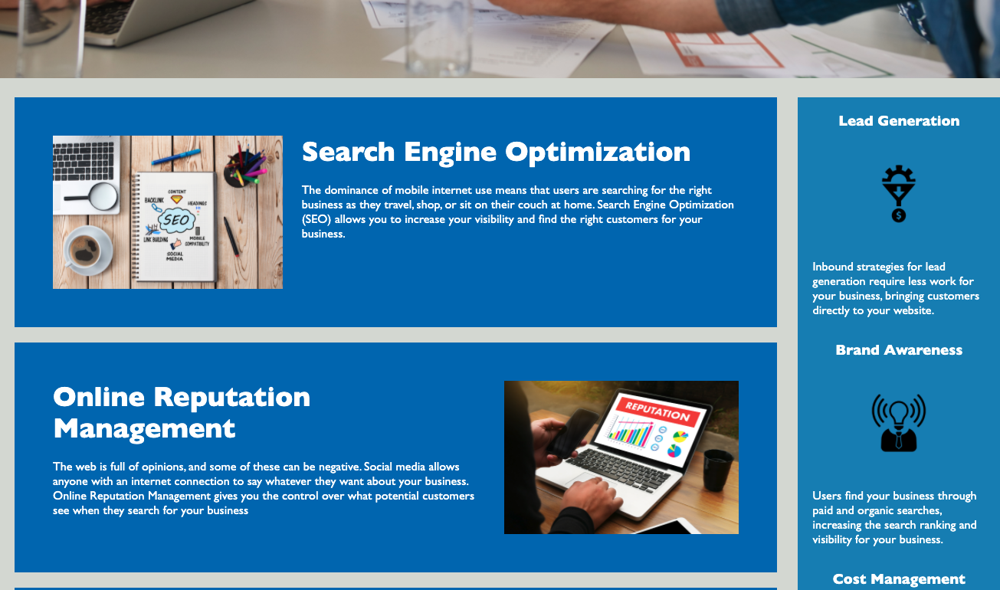
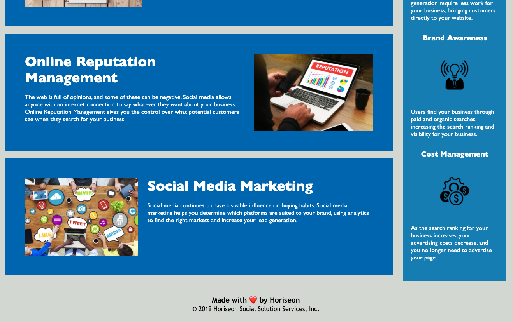

# Code-Refactor

Horiseon webpage aims to help guide our prospective clients through our services and benefits to better management of their online presence. Through this site one will understand our core mission to provide: online search engine optimization, online representation management and social media marketing. With ambitions of reaching a wide client base and offering un paralleled accessibility, we have updated our webpage to deploy semantic block elements. 

In order to achieve an accessible webpage for Horiseon, semantic tags were deployed and used in place of the pre-existing div elements. Key navigation tags were deployed inside the header to following a logical structure, that independent of styling and positioning. Other semantic tags, such as article, figure, footer and sections were used to update elements of the HTML file that were previously unspecific. 

link to webpage: https://benrgross.github.io/Code-Refactor/

